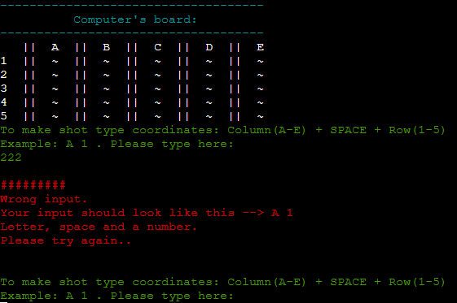
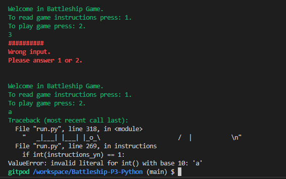
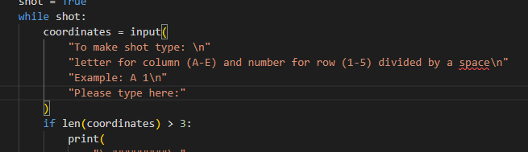
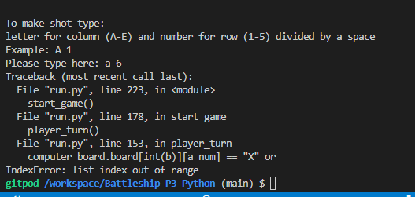
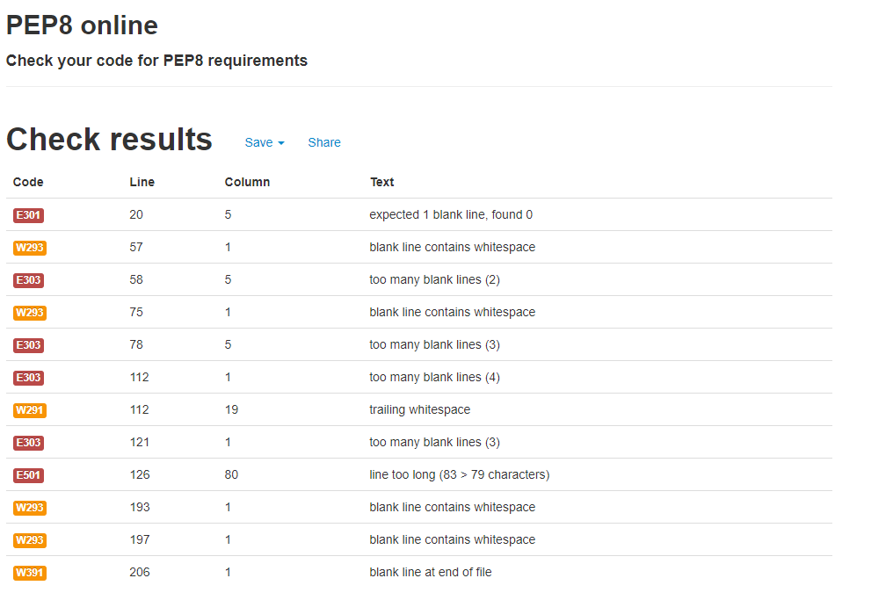

 
<h1 align="center">BATTLESHIP GAME</h1>

  <strong>PLAYER VS COMPUTER</strong>

CLASSIC GAME THAT ENTERTAIN EVERYONE

 

  
  
  
  

  
  

  <h3>
    <a href="https://battleship-p3-ci.herokuapp.com/">
      🌍Live Website
    </a>
     | 
    <a href="https://github.com/LucasP1vko/Battleship-P3-Python">
      💾Github Repository
    </a>
     | 
    <a href="https://codeinstitute.net/ie/">
      Code Institute
    </a>
  </h3>

> ## How to play
- Battleship game goal is to defeat all enemy ships before the enemy will shot yours. Both: player and computer (enemy) ships are allocated randomly around the board.To guess enemy ships position player needs to: type coordinates in specific format: Letter for Column and numer for Row divided by space. Example: A 1. Board contains columns A,B,C,D,E and rows 1,2,3,4,5. First one to shot 5 of enemy ships wins the game! Good Luck!
> ## Features

- Automatic ships placement
- Gameplay against computer
- Attractive artwork at game start
- Game fit perfectly heroku display console

Colorful messages and errors

### Future Features

- Allow user to select the board size and number of ships 
- Allow user to position ships themselves

> ## Testing

I have manually tested this project by doing the following

- Passed the code through a PEP8 and confirmed that there are no problems
- Given incorrect input: input format, out of range lenght
- Tested in my local terminal and the code Institute Heroku Terminal
- Family tested on their devices as well :)

> ## Bugs fixed in production

   

Instructions display prompt input ValueError

\n added after all inputs for heroku purposes

Error for column coordinate value input greater than column number

PEP8 errors fixed

> ## Remaining Bugs
    - No bugs remaining

> ## Validator Testing
    - PEP8
        * No errors were returned from PEP8online.com

> ## Deployment 

- The game was deployed using Heroku and the Code Institute Python template. 
[The Python Code Institute template can be found here](https://github.com/Code-Institute-Org/python-essentials-template)

- The following steps were taken for the deployment process:

    - Ensure that the template used for the project is made with the Code Institute Python template linked above. 
    - Second, in all Python scripts, ensure that input methods have a new line character at the end of the text inside.
    - If any packages or installments were made, type in the following command in the terminal: **'pip3 freeze > requirements.txt'** so these installments / dependencies can work on Heroku. After typing this in, the requirements.txt file in the Code Institute Python template will automatically be updated. 
    - Commit and push these changes onto GitHub.
    - [Create an account for Heroku](https://id.heroku.com/login)
    - On the Heroku dashboard, go to **Create new app**. 
    - Name your app (must be a unique name) and select your region, and go to **Create app**.
    - On the next page after selecting **Create app**, go to the **Settings** tab. Scroll down to **Config Vars** and select **Reveal Config Vars**.
    - Since no APIs or Creds were used for Pirate Ship, the only Config Vars added was:
    Key: PORT / 
    Value: 8000
    - Next, scroll down to **Buildpacks**. Click **Add Buildpack** and select **Python** and **Save Changes**. Next, add **nodejs** and **Save changes**. Ensure Python is on top and nodejs is below. 
    - Next, scroll up and go to the **Deploy** tab.
    - Under **Deployment method**, select **GitHub** and confirm **Connect to GitHub**. 
    - Search for your repository name and click **Connect**.
    - Scroll down and select **Deploy Branch** next to **Manual Deploy**. Ensure the branch to deploy is master/main. 
    - Deployment gets created and live link is then previewed. 

[View live project here](https://battleship-p3-ci.herokuapp.com/)

> ## Deployment Link
  - [Heroku deployment link](https://battleship-p3-ci.herokuapp.com/)
  - [Github link](https://github.com/LucasP1vko/Battleship-P3-Python)

> ## Credits
- Thanks to my mentor Jack W. for help with planning my project.
- I found concept of using colours in terminal in [battleship-blast](https://github.com/stephaniecrocker91/battleship-blast) project of [stephaniecrocker91](https://github.com/stephaniecrocker91).
- In [How To Print Colored Text in Python (Colorama Tutorial)
](https://www.youtube.com/watch?v=u51Zjlnui4Y) video from [Tech With Tim
](https://www.youtube.com/c/TechWithTim) channel and his [GitHub page](https://github.com/techwithtim/ColoredTextInPython/blob/main/tutorial.py) I learned how to implement Colorama to my project,
- Big credit for [Damianjacob](https://github.com/Damianjacob) I learned a lot from his [project](https://github.com/Damianjacob/MS3-Battleship-Game) and got many solutions from it when got stuck.
- Biggest support to my work on this project was [Code Institute](https://codeinstitute.net/ie/) where I learned how to use Python.
- Also content from [Grepper](https://www.codegrepper.com/), [PYnative](https://pynative.com/),[Stack Overflow](https://stackoverflow.com/) and [W3schools](https://www.w3schools.com/) and of course [Google](https://www.google.com/) was great support.
- YouTube tutorial [Python OOP Tutorial 1: Classes and Instances
](https://www.youtube.com/watch?v=ZDa-Z5JzLYM&list=PLdCHlqeB2-az93nC_gErumI75AvTA0l74&index=12) from CoreySchaffer channel helped me to look from different approach at classes.
 

<b>THANK YOU ALL!😃👍</b>

> ## Resources

- [Colorama](https://pypi.org/project/colorama/) For colorfull messages in terminal,
- [Techsini](https://techsini.com/multi-mockup/index.php) For mockup creating,
- [PEP8](http://pep8online.com/checkresult) For checking my code.
- [Lucidchart](https://lucid.app/) To create flowchart.
- [Heroku](https://dashboard.heroku.com/apps) for my application deployment,
- [ASCII art archive](https://www.asciiart.eu/) where I found ships art in ascii code used in app artwork,
- [ASCII art generator](https://www.ascii-art-generator.org/) to make game logo and win and lose message artwork,

